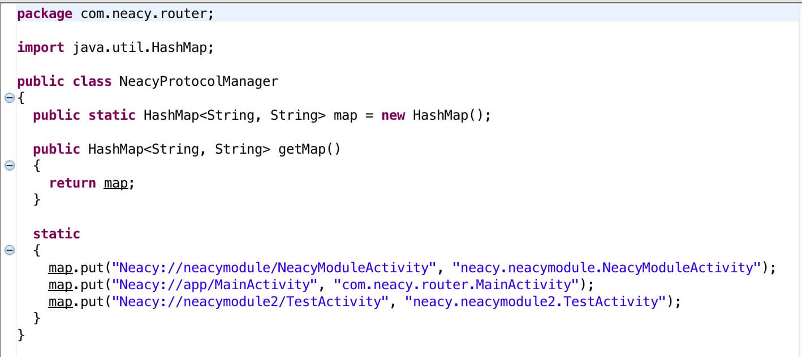
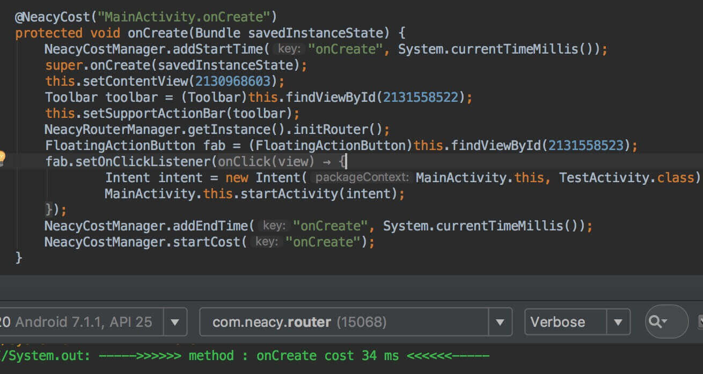

# 如何使用


在目录`NeacyPlugin/app/build.gradle`  中加入plugin声明 `apply plugin: com.neacy.plugin.NeacyPlugin`


Neacyprotocol：标记跳转协议  
NeacyCost    ：标记方法耗时

```java
@NeacyProtocol("Neacy://neacymodule/NeacyModuleActivity")
public class NeacyModuleActivity extends AppCompatActivity {
  
    @Override  
    @NeacyCost("MainActivity.onCreate")  
    protected void onCreate(@Nullable Bundle savedInstanceState) {
        super.onCreate(savedInstanceState);
        setContentView(R.layout.neacy_module_layout);  
    }  
}
```


生成路由表：  

  

插入的方法耗时统计：  




轻松实现协议跳转：
```java
Bundle bundle = new Bundle();
bundle.putString("neacy", "Neacy from Intent");
NeacyRouterManager.getInstance().startIntent(TestActivity.this, "Neacy://neacymodule/NeacyModuleActivity", bundle);
```

# Thanks

感谢巴掌CostTime：  
<https://github.com/JeasonWong/CostTime/>


# License
Null...